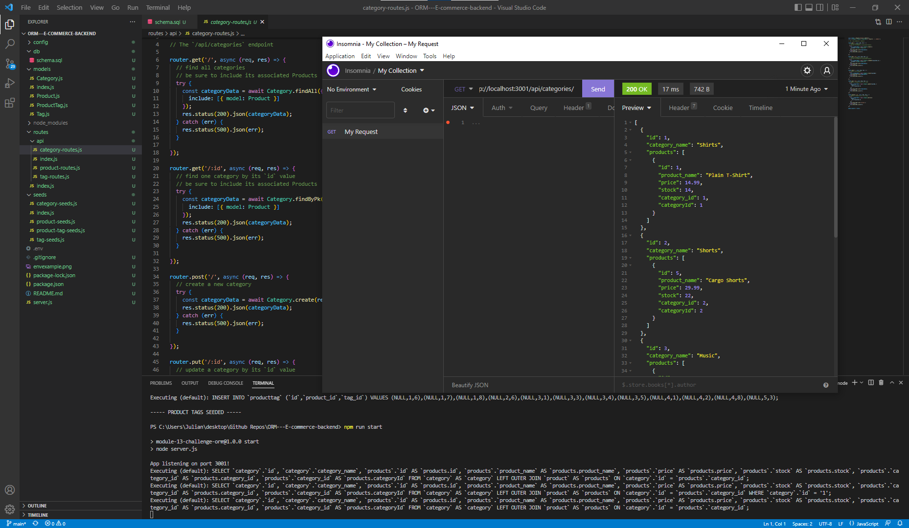
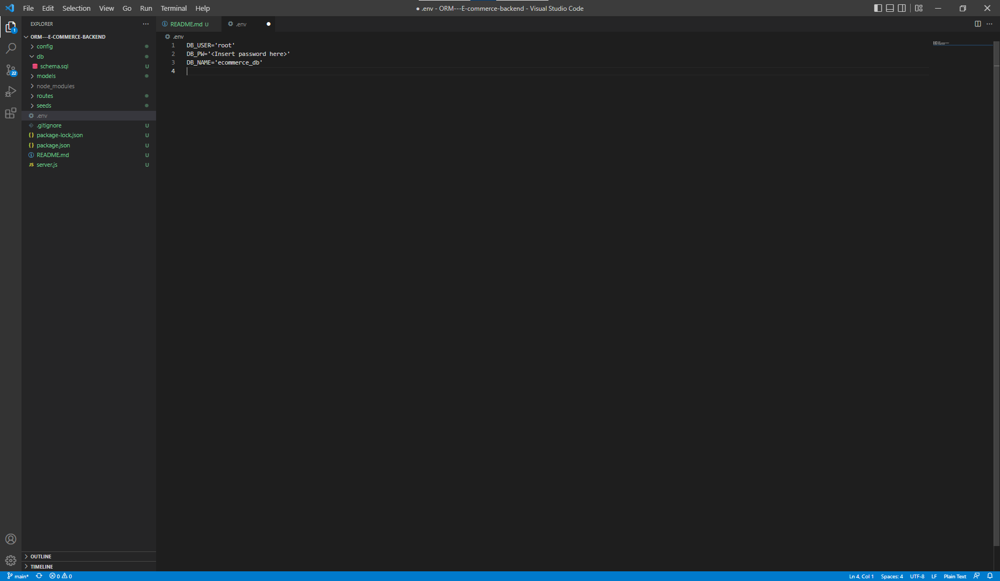

# E-commerce backend 

## Description

### What does E-commerce backend do?

Uses sequelize and express to interact with the sql database and setup routes for a would-be ecommerce site.


### Successes and Failures

This project meets all original goals.

## Table of Contents

- [Installation](#installation)
- [Usage](#usage)
- [Credits](#credits)
- [Contribution](#contribution)
- [Questions](#questions)
- [Licence](#licence)

---

## Installation 

### Technologies Used in Development

Technologies used include:

MySQL for the database, the npm packages sequelize and express, and dot env to store credentials.

### Installation Instructions

```md
run npm install to install the required dependencies.
```

## Usage





```md
Connect to sql and run source ./db/schema.sql; to create the database. Create a .env file like the one in the readme. In the root of the project run npm seed to populate the database. Finally run npm start to start the project. There is no front end, the routes can be tested with insomnia or postman or other applications.
```

## Credits

I wrote all the code in the routes and models folders, the rest was provided by the Bootcamp

## Contribution

Guidelines for contribution:

No contribution necessary.

## Questions

No Contact necessary.

https://github.com/jq67


---
## Licence
This project is covered under the `Mit License`